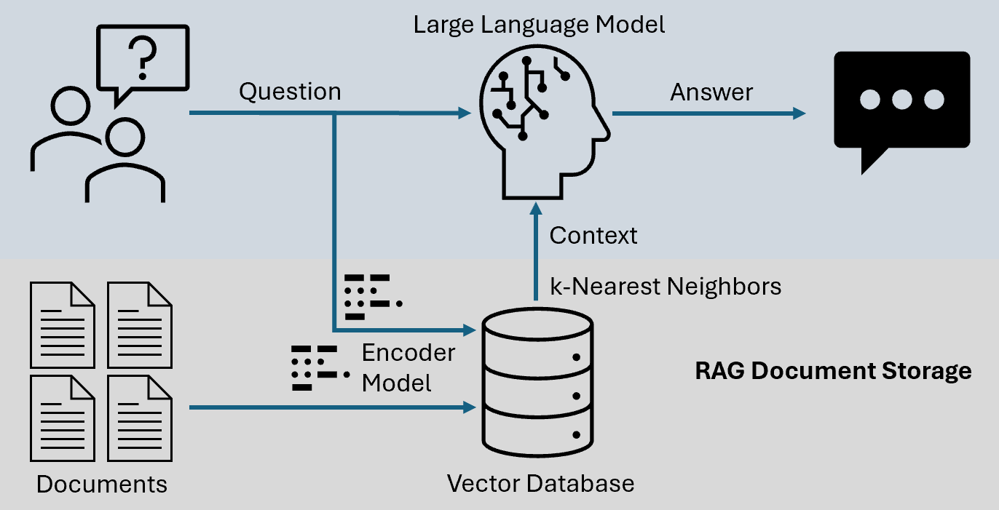
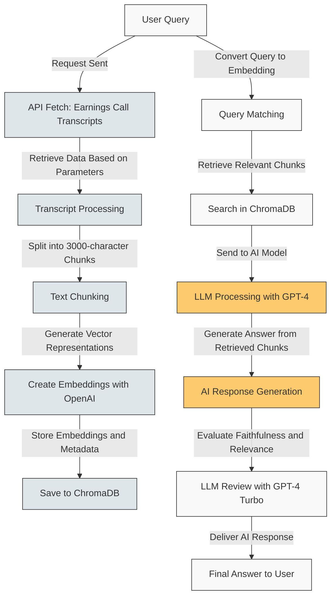
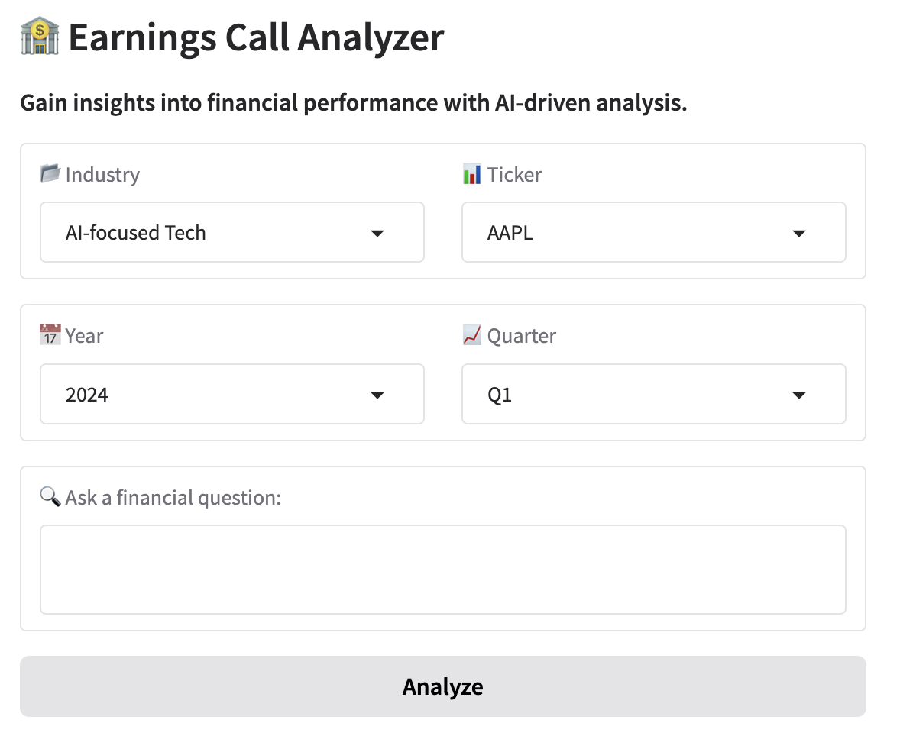

# Earnings Call Analyzer  
### AI-Powered Insights for Earnings Transcripts  

---

## Project Description
Insightful Consulting Group (ICG) is expanding into investment management and has been tasked with developing an AI prototype to streamline the analysis of earnings reports. During earnings season, research analysts face an overwhelming influx of reports, making it difficult to extract valuable insights efficiently. This project enhances decision-making and productivity by enabling users to query earnings call transcripts and receive AI-driven responses in real time.

---

## Dataset
The dataset consists of **earnings call transcripts from 2024**, dynamically retrieved from **[API Ninja's Financial Transcript API](https://api-ninjas.com/)** and preprocessed for **natural language processing (NLP)**. Each transcript includes the following attributes:

- **Industry** – The sector in which the company operates.
- **Ticker Symbol** – The stock ticker uniquely identifying the company.
- **Quarter** – The financial quarter in which the earnings call took place (Q1, Q2, Q3, or Q4).
- **Year** – The fiscal year corresponding to the earnings call.
- **Transcript Text** – The full text of the earnings call, including statements made by executives and analysts.
- **Date of Transcript** – The specific date when the earnings call occurred.

This structured dataset allows efficient retrieval and analysis, enabling analysts to gain insights quickly and accurately.

### Data Source
Earnings call transcripts are retrieved in real time using **API Ninja**, a financial data provider offering access to company earnings transcripts. This integration enables the system to dynamically fetch the latest transcripts for informed decision-making.

### Data Preprocessing
To enhance retrieval accuracy and optimize response generation, the AI system applies several preprocessing steps:

1. **API Data Extraction**
   - API requests retrieve transcripts based on industry, company ticker, fiscal year, and financial quarter.
   - The API response is parsed and converted into a structured format for efficient processing.

2. **Text Cleaning & Standardization**
   - Special characters, excessive whitespace, and formatting inconsistencies are removed.
   - Speaker labels (e.g., "CEO", "Analyst") and interruptions are handled for readability.

3. **Metadata Structuring**
   - Industry classifications and company tickers are standardized.
   - Date formats are normalized for consistency and accurate time-based analysis.

These preprocessing steps ensure that earnings call transcripts are clean, structured, and ready for efficient analysis.

---

## Code Structure

The system consists of the following core functions:

1. **`generate_embedding()`**
   - **Purpose**: Creates vector embeddings for a given text chunk.
   - **How it works**: Converts text into numerical representations using a model like OpenAI's `text-embedding-ada-002`. These embeddings facilitate comparison and retrieval of relevant information.

2. **`chunk_text()`**
   - **Purpose**: Splits long transcripts into smaller, manageable chunks.
   - **How it works**: Breaks the text into 3,000-character chunks with a 500-character overlap, ensuring no loss of context.

3. **`store_embeddings()`**
   - **Purpose**: Manages both chunking and storing of text embeddings.
   - **How it works**:
     - Calls `chunk_text()` to split the text.
     - Uses `generate_embedding()` to create vector embeddings.
     - Stores embeddings in ChromaDB, along with metadata (e.g., company ticker, year, quarter) for efficient retrieval.

4. **`query_rag()`**
   - **Purpose**: Performs retrieval-augmented generation (RAG) by retrieving relevant document chunks.
   - **How it works**:
     - Calls `generate_embedding()` to create an embedding for the user's query.
     - Searches for similar chunks in the vector database.
     - Uses retrieved chunks to formulate a contextually accurate response.

5. **`evaluate_response()`**
   - **Purpose**: Assesses the accuracy and relevance of AI-generated responses.
   - **How it works**: Passes the user’s query, AI response, and retrieved document chunks to a stronger model (e.g., GPT-4 Turbo) for evaluation.

6. **`query_and_display()`**
   - **Purpose**: Processes the user query and displays the generated response.
   - **How it works**: Sends the query through the RAG pipeline (`query_rag()`) and presents the AI-generated response in a user-friendly format.

7. **`update_ticker_dropdown()`**
   - **Purpose**: Ensures that the list of available company tickers is up to date.
   - **How it works**: Fetches and updates the list of available companies for querying.

This workflow ensures that transcripts are chunked, embedded, and stored efficiently, enabling rapid and accurate retrieval when users submit queries.

---

## Methodology

### What is Retrieval-Augmented Generation (RAG)?
RAG enhances AI-generated responses by first retrieving relevant text from a database and then using that text to generate precise answers. This approach ensures responses are grounded in actual data rather than relying solely on the AI's built-in knowledge.

### System Workflow

1. **Transcript Retrieval**
   - API Ninja fetches transcripts based on user-selected parameters (company ticker, industry, year, quarter).
   - Retrieved transcripts are processed and stored.

2. **Text Chunking & Vector Embeddings**
   - Transcripts are split into 3,000-character chunks with a 500-character overlap using LangChain’s `RecursiveCharacterTextSplitter`.
   - Each chunk is converted into a vector embedding using OpenAI's `text-embedding-ada-002`.

3. **Storing Vector Embeddings**
   - Embeddings are stored in **ChromaDB** along with metadata (ticker, year, quarter).
   - ChromaDB enables efficient similarity searches.

4. **Query Matching & Context Extraction**
   - The system converts the user’s question into a vector embedding.
   - A similarity search retrieves the most relevant transcript chunks.
   - Retrieved chunks are used to generate AI responses.

5. **LLM Processing**
   - The AI (e.g., GPT-4) generates a response based on retrieved transcript data.
   - If insufficient information is available, the AI states its limitations instead of fabricating an answer.

6. **Response Evaluation**
   - The response is reviewed using an LLM-based evaluation system (`LLM as a Judge`).
   - GPT-4 Turbo assesses faithfulness, relevance, and accuracy.

---

## Visual Representation of the Workflow

## Model Evaluation

The AI system is assessed based on the following key metrics:

### Faithfulness
- Ensures that responses are factually accurate and grounded in the original transcript data.
- Reduces the likelihood of AI-generated hallucinations or misinformation.

### Relevance
- Measures how closely the response aligns with the user's query.
- Prioritizes direct excerpts from transcripts to maintain contextual accuracy.

### AI Confidence Score
- Evaluates the reliability of the AI-generated response based on:
  - **Transcript Matching Percentage** – The degree to which the response aligns with the original earnings call transcript.
  - **Financial Data Consistency** – Ensures accuracy in reported figures such as revenue, profit margins, and other financial metrics.
  - **Linguistic and Contextual Accuracy** – Assesses the coherence, readability, and appropriateness of the response in the given financial context.

---

## Future Enhancements

The system will continue evolving with improvements in several key areas:

1. **User Feedback Loops**
   - Implement a rating system for users to evaluate AI-generated responses.
   - Use feedback to refine AI performance and improve accuracy over time.

2. **Machine Learning Fine-Tuning**
   - Further optimize the AI model to better understand financial terminology, market trends, and sector-specific nuances.

3. **Multilingual Support**
   - Expand support for multiple languages to enable analysis of earnings calls from international companies.

4. **Real-Time Transcript Updates**
   - Integrate automated transcript retrieval to ensure the latest earnings call data is always available for analysis.

5. **Advanced NLP Models**
   - Leverage state-of-the-art natural language processing architectures to enhance contextual understanding, entity recognition, and sentiment analysis.

---

## Visualizations

### Gradio Interface:
The project features an interactive **Gradio-based user interface**, allowing users to query earnings call transcripts efficiently.

---

## License

This project is licensed under the **MIT License**.  
See the [`LICENSE`](LICENSE) file for more details.
