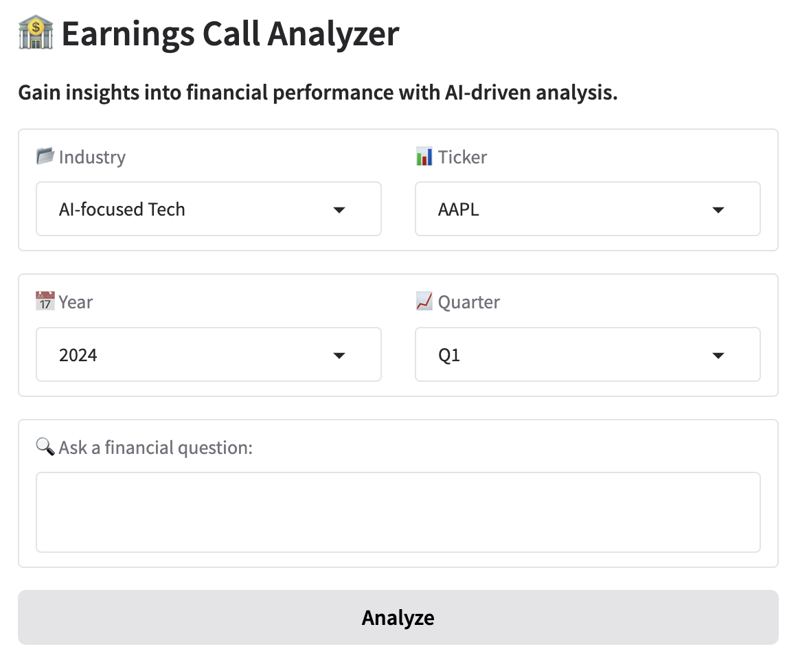

# Earnings Call Analyzer  
### AI-Powered Insights for Earnings Transcripts  

---

## Project Description
Insightful Consulting Group (ICG) is expanding into investment management and has been tasked with developing an AI prototype to streamline earnings report analysis. During earnings season, research analysts face an overwhelming influx of reports, making it difficult to extract valuable insights efficiently. This project enables users to query earnings call transcripts and receive instant, AI-driven responses to improve decision-making and efficiency.

## 📊 Dataset
The dataset consists of **earnings call transcripts from 2024**, retrieved dynamically from **API Ninja's financial transcript API** and formatted for **natural language processing (NLP)**. The dataset has been structured to allow for efficient retrieval of relevant financial insights. Each transcript contains:

- **Industry** - The sector in which the company operates.
- **Ticker Symbol** - The stock ticker used to identify the company.
- **Quarter** - The financial quarter in which the earnings call took place (Q1, Q2, Q3, Q4).
- **Year** - The fiscal year of the earnings call.
- **Transcript Text** - The full text of the earnings call, including statements from executives and analysts.
- **Date of Transcript** - The specific date when the earnings call occurred.

### 📁 Source
Earnings call transcripts are **retrieved in real-time** via **[API Ninja](https://api-ninjas.com/)**, which provides financial data, including company earnings reports. This allows the system to **fetch the latest transcripts dynamically**, ensuring up-to-date insights.

### 🔄 Data Preprocessing
To enhance retrieval accuracy and optimize response generation, several preprocessing steps are applied:

1. **API Data Extraction**
   - API requests are structured to fetch transcripts based on selected industry, company ticker, year, and quarter.
   - The API response is parsed and converted into a structured format.

2. **Text Cleaning & Standardization**
   - Special characters, excessive whitespace, and formatting inconsistencies are removed.
   - Speaker labels and interruptions are handled to improve readability.

3. **Metadata Structuring**
   - Industry classifications and company tickers are normalized.
   - Date formats are standardized for consistency.

---

## 🛠️ Methodology
This project employs **retrieval-augmented generation (RAG)** to ensure users receive **the most relevant answers** when querying earnings call transcripts. The workflow consists of:

### 1️⃣ **Transcript Retrieval**
   - The application **queries API Ninja** based on user-selected parameters.
   - If a transcript is available, it is **retrieved, processed, and stored**.
   - The API is used to retrieve transcripts for a number of companies from different industries

### 2️⃣ **Transcript document chunking and creating vector embeddings
   - Each of the transcripts are chunked into 3000 character long chunks with an overlap of 500 characters using LangChain's RecursiveCharacterTextSplitter.
   - Using OpenAI's embedding model **text-embedding-ada-002**, vector embeddings are created for each chunk.

### 3️⃣ **Store vector embeddings in vector database
   - The implementation uses **ChromaDB** as the Vector database.
   - Vector embeddings for each chunk are stored in ChromaDB along with metadata relating to the chunk such as Ticker, Year and Quarter.

### 4️⃣ **Query Matching & Context Extraction**
   - Users input the ticker, year and quarter along with their question on a transcript.
   - A vector embedding for the question is created using the same embedding model **text-embedding-ada-002**.
   - A similarity search is performed on the vector database to find the top three chunks that are most similar to the question.  The chunks are filtered to relate only to the ticker, year, and quarter entered by the user using the metadata stored with the chunks.

###  **Create a prompt and pass to the LLM**
   - The user question along with the three document chunks retrieved from the vector database are used to create a prompt to be passed into an LLM.  At this stage, the LLM being used is OpenAI's GPT-4 model.
   - The LLM should try to answer the question based on the document chunks that appear in the prompt.  
   - If the LLM cannot answer the question from the document chunks, the LLM should repsond that it is unable to answer the question based on the document chunks provided.   

###  **LLM as a Judge - Evaluation & Response Scoring**
   - In order to evaluate if the LLM has answered the question appropriately, an approach called **LLM as a Judge** is employed.  This approach is the only one available as we do not have human generated responses to compare against.
   - A prompt for evaluation is created that includes the user question, the answer that was generated along with the three document chunks. 
   - The prompt is passed to a more powerful model LLM.  In this case, the LLM being used to evaulate how well the question was answered is GPT-4 Turbo. It is considered good practice to use a more powerful LLM when evaluating the answer generated previously.
   

   

---

## 📏 Evaluation
The model is assessed based on **three primary evaluation metrics** to ensure reliability:

### ✅ **Faithfulness**
- Ensures that responses accurately reflect the earnings call transcripts.
- Minimizes hallucination risks in AI-generated content.

### 🎯 **Relevance**
- Measures how closely the response aligns with the **user’s query**.
- Prioritizes **direct transcript excerpts** over AI-generated answers.

### 🤖 **AI Confidence Score**
- AI responses are **ranked based on reliability**, factoring in:
  - **Transcript matching percentage**
  - **Financial data consistency**
  - **Linguistic and contextual accuracy**

Future updates will incorporate **user feedback loops** and **machine learning fine-tuning** to enhance response accuracy.
