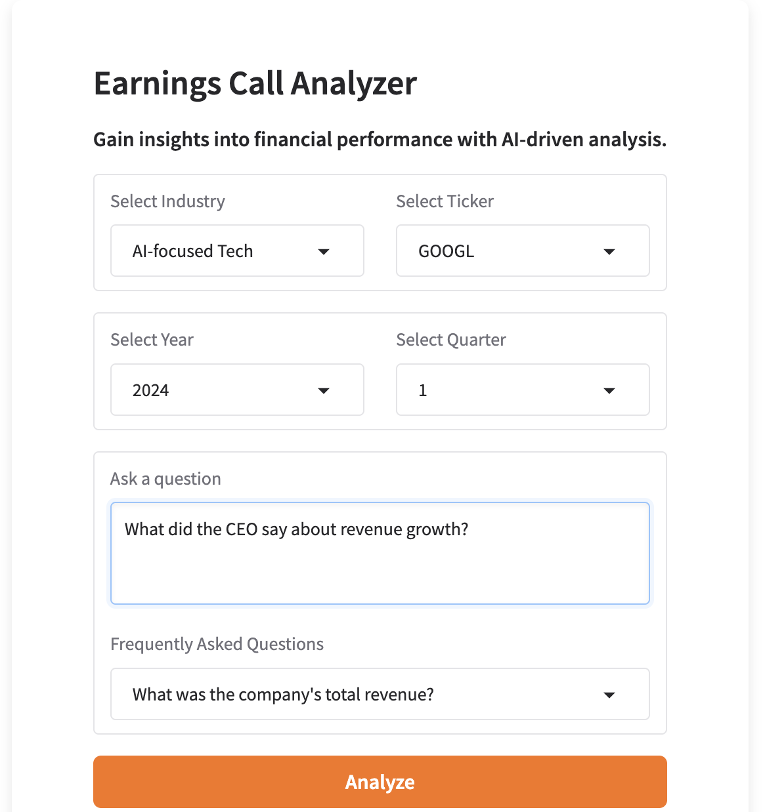

# Earnings Call Transcript Analyzer  
### AI-Powered Insights for Earnings Transcripts  

---

## Project Description  
Insightful Consulting Group (ICG) is expanding into investment management and is developing an AI-driven tool to enhance the analysis of earnings call transcripts. During earnings season, research analysts must sift through a vast number of company earnings releases, making it challenging to extract meaningful insights efficiently.  

This project leverages a **Retrieval-Augmented Generation (RAG) model** to improve decision-making and productivity. Users can query pre-processed earnings call transcripts and receive AI-generated answers based on relevant retrieved excerpts. While the system does not process transcripts in real-time, it enables analysts to efficiently extract key information by retrieving the most relevant sections of stored transcript data and generating concise responses.

---

# Table of Contents  

- [Project Description](#project-description)  
- [Dataset](#dataset)  
  - [Data Fields](#data-fields)  
  - [Data Retrieval Process](#data-retrieval-process)  
  - [Data Preprocessing](#data-preprocessing)  
- [Code Structure](#code-structure)  
- [Methodology](#methodology)  
  - [What is Retrieval-Augmented Generation (RAG)?](#what-is-retrieval-augmented-generation-rag)  
  - [System Workflow](#system-workflow)  
- [Visual Representation of the Workflow](#visual-representation-of-the-workflow)  
- [Model Optimization](#model-optimization)  
- [Model Evaluation](#model-evaluation)  
- [Gradio Interface Overview](#gradio-interface-overview)  
- [Product Demo Walkthrough](#product-demo-walkthrough)  
  - [Launching the Gradio Interface](#1-launching-the-gradio-interface)  
  - [Entering a Query](#2-entering-a-query)  
  - [Processing and Generating Results](#3-processing-and-generating-results)  
  - [Quality Score Evaluation](#4-quality-score-evaluation)  
- [Test Cases and Results](#test-cases-and-results)  
  - [Key Adjustments](#key-adjustments)  
  - [Example: Off-Topic Question Failure](#example-off-topic-question-failure)  
- [Key Features of the Gradio UI](#key-features-of-the-gradio-ui)  
- [Conclusion](#conclusion)  
- [Future Enhancements](#future-enhancements)  
- [License](#license)  

---

## Dataset  
The dataset consists of **earnings call transcripts from 2024**, retrieved using the **[API Ninja Financial Transcript API](https://api-ninjas.com/)** and structured for efficient analysis. The system dynamically fetches transcripts based on industry, stock ticker symbol, fiscal year, and financial quarter. The retrieved data undergoes preprocessing to ensure consistency and usability for querying.

### Data Fields  
Each record in the dataset contains the following attributes:

- **Ticker** – The stock ticker symbol that uniquely identifies the company.
- **Industry** – The sector in which the company operates.
- **Year** – The fiscal year of the earnings call.
- **Quarter** – The financial quarter in which the earnings call took place (Q1, Q2, Q3, or Q4).
- **Date** – The specific date of the earnings call (if available).
- **Speaker** – The individual speaking during the call (e.g., CEO, CFO, Analyst).
- **Transcript** – The spoken text from the earnings call, structured in a **[Speaker]: Text** format.

### Data Retrieval Process  
Earnings call transcripts are fetched via **API requests** based on predefined company lists, fiscal quarters, and the target year. The system ensures robust API interaction through:

1. **Dynamic Querying**  
   - Retrieves transcripts for multiple companies across various industries.  
   - Supports batch API calls while adhering to rate limits.  

2. **Rate-Limiting Protection**  
   - Implements **delayed requests** to prevent API throttling.  
   - Uses a progress bar to track retrieval status.  

3. **Secure API Key Handling**  
   - Ensures secure API authentication via encrypted inputs.  

### Data Preprocessing  
Once transcripts are retrieved, they undergo **cleaning and structuring** to optimize storage and readability:

1. **Text Consolidation**  
   - Transcripts are grouped by **ticker, industry, year, quarter, and date**.  
   - Speaker-attributed dialogue is formatted into structured text blocks for clarity.  

2. **Standardization & Formatting**  
   - Speaker labels are retained for context.  
   - Whitespace and special characters are removed.  
   - Date formats are normalized for consistency.  

3. **Final Structuring**  
   - The cleaned dataset is converted into a structured **CSV format** for further analysis.  

This preprocessing pipeline ensures that the dataset is **clean, structured, and optimized** for downstream applications, such as natural language querying and financial research.

---

## Code Structure

The system consists of the following core functions:

1. **`generate_embedding()`**
   - **Purpose**: Creates vector embeddings for a given text chunk.
   - **How it works**: Converts text into numerical representations using a model like OpenAI's `text-embedding-ada-002`. These embeddings facilitate the comparison and retrieval of relevant information.

2. **`chunk_text()`**
   - **Purpose**: Splits long transcripts into smaller, manageable chunks.
   - **How it works**: Breaks the text into 3,000-character chunks with a 500-character overlap, ensuring no loss of context.

3. **`store_embeddings()`**
   - **Purpose**: Manages both chunking and storing of text embeddings.
   - **How it works**:
     - Calls `chunk_text()` to split the text.
     - Uses `generate_embedding()` to create vector embeddings.
     - Stores embeddings in ChromaDB, along with metadata (e.g., company ticker, year, quarter) for efficient retrieval.

4. **`query_rag()`**
   - **Purpose**: Performs retrieval-augmented generation (RAG) by retrieving relevant document chunks.
   - **How it works**:
     - Calls `generate_embedding()` to create an embedding for the user's query.
     - Searches for similar chunks in the vector database.
     - Uses retrieved chunks to formulate a contextually accurate response.

5. **`evaluate_response()`**
   - **Purpose**: Assesses the accuracy and relevance of AI-generated responses.
   - **How it works**: Passes the user’s query, AI response, and retrieved document chunks to a stronger model (e.g., GPT-4 Turbo) for evaluation.

6. **`query_and_display()`**
   - **Purpose**: Processes the user query and displays the generated response.
   - **How it works**: Sends the query through the RAG pipeline (`query_rag()`) and presents the AI-generated response in a user-friendly format.

7. **`update_ticker_dropdown()`**
   - **Purpose**: Ensures that the list of available company tickers is up-to-date.
   - **How it works**: Fetches and updates the list of available companies for querying.

This workflow ensures that transcripts are chunked, embedded, and stored efficiently, enabling rapid and accurate retrieval when users submit queries.

---

## Methodology

### What is Retrieval-Augmented Generation (RAG)?
RAG enhances AI-generated responses by first retrieving relevant text from a database and then using that text to generate precise answers. This approach ensures responses are grounded in actual data rather than relying solely on the AI's built-in knowledge.

### System Workflow

1. **Transcript Retrieval**
   - API Ninja fetches transcripts based on user-selected parameters (company ticker, industry, year, quarter).
   - Retrieved transcripts are processed and stored.

2. **Text Chunking & Vector Embeddings**
   - Transcripts are split into 3,000-character chunks with a 500-character overlap using LangChain’s `RecursiveCharacterTextSplitter`.
   - Each chunk is converted into a vector embedding using OpenAI's `text-embedding-ada-002`.

3. **Storing Vector Embeddings**
   - Embeddings are stored in **ChromaDB** along with metadata (ticker, year, quarter).
   - ChromaDB enables efficient similarity searches.

4. **Query Matching & Context Extraction**
   - The system converts the user’s question into a vector embedding.
   - A similarity search retrieves the most relevant transcript chunks.
   - Retrieved chunks are used to generate AI responses.

5. **LLM Processing**
   - The AI (e.g., GPT-4) generates a response based on retrieved transcript data.
   - If insufficient information is available, the AI states it cannot answer the question based on the document chunks provided.

6. **Response Evaluation**
   - The response is reviewed using an LLM-based evaluation system (`LLM as a Judge`).
   - GPT-4 Turbo assesses faithfulness, relevance, and accuracy.

---

## Visual Representation of the Workflow

## Model Optimization

To improve the model, we optimized on three key areas:

1. **Embedding Model Selection**  
   - Tested OpenAI’s **text-embedding-ada-002** (smaller, faster) vs. **text-embedding-3-large** (larger, more powerful).  
   - **Result:** No significant improvement with the larger model.  The smaller model performed just as well.  

2. **Chunk Size & Overlap Adjustments**  
   - Started with **1,000-character chunks** (200 character overlap).  
   - Switched to **3,000-character chunks** (500 character overlap), which preserved more context and improved response quality.  

3. **Upgrading the Vector Database**  
   - Moved from **FAISS** (efficient but lacked metadata filtering) to **ChromaDB**, which allows filtering by **Ticker, Year, and Quarter**.  
   - **Result:** More precise retrieval of relevant transcript sections, improving accuracy.  

---
## Model Evaluation

The AI system is assessed based on the following key metrics:

### Faithfulness
- Ensures that responses are factually accurate and grounded in the original transcript data.
- Reduces the likelihood of AI-generated hallucinations or misinformation.

### Relevance
- Measures how closely the response aligns with the user's query.
- Prioritizes direct excerpts from transcripts to maintain contextual accuracy.

### AI Confidence Score
- Evaluates the reliability of the AI-generated response based on:
  - **Transcript Matching Percentage** – The degree to which the response aligns with the original earnings call transcript.
  - **Financial Data Consistency** – Ensures accuracy in reported figures such as revenue, profit margins, and other financial metrics.
  - **Linguistic and Contextual Accuracy** – Assesses the coherence, readability, and appropriateness of the response in the given financial context.

---

   
# Interactive Product Demo: Gradio UI for Earnings Calls  
### AI-Powered Insights for Earnings Transcripts  

---

## Gradio Interface Overview  
This project features an **interactive Gradio-based user interface**, enabling users to efficiently query and analyze **pre-processed** earnings call transcripts. The interface provides an intuitive way for financial analysts and researchers to extract insights from stored earnings call data, ensuring quick and accurate responses based on retrieved transcript excerpts.  

---

## Product Demo Walkthrough  

### 1. **Launching the Gradio Interface**  
- The landing page provides a user-friendly input field for querying earnings call transcripts.  
- Users can enter questions in **natural language** to retrieve insights.  

---

### 2. **Entering a Query**  
- Users **select the industry, company ticker, year, and quarter** before entering a question.  
- In this example, the user asks: *"What did the CEO say about revenue growth?"*  
- The system processes the request and retrieves relevant transcript sections.  

---

### 3. **Processing and Generating Results**  
- The AI-powered system searches the **earnings call transcript database** for relevant information.  
- The **Analysis Result** provides a summary of the CEO’s statements on revenue growth.  
- The **Transcript Extracts** section displays the exact text from the earnings call.  

---

### 4. **Quality Score Evaluation**  
- The system assigns a **Quality Score** to evaluate the accuracy and relevance of the generated response.  
- **Faithfulness Score** ensures the answer is accurately grounded in the transcript.  
- **Relevance Score** measures how well the response aligns with the user’s query.  
- The **Overall Quality Score** helps users assess response accuracy.  

---

## Test Cases and Results  
To evaluate the effectiveness of the model, we tested five key question types:  

| **Question Type**   | **Actual Question**                            | **Results**                                                                 | **Human Assessment (Pass/Fail)** | **Tool's Quality Score** |
|---------------------|-----------------------------------------------|-----------------------------------------------------------------------------|----------------------------------|--------------------------|
| **Quantitative**    | What was the company's total revenue?         | System retrieved relevant financial figures from the earnings transcript.   | Pass                             | Faithfulness: 5, Relevance: 5, Overall: 5 |
| **Quantitative**    | How did the company perform last quarter?     | Model returned the latest financial report instead of the previous quarter, failing to distinguish between periods. | Fail                             | Faithfulness: 5, Relevance: 5, Overall: 5 |
| **Quantitative**    | How did the company perform this quarter?     | Model correctly retrieved the latest financial report.                      | Pass                             | Faithfulness: 5, Relevance: 5, Overall: 5 |
| **Qualitative**     | What did the CEO say about revenue growth?    | Provided a well-structured summary of the CEO’s discussion on revenue.      | Pass                             | Faithfulness: 5, Relevance: 5, Overall: 5 |
| **Inference**       | What was the main reason for revenue growth?  | AI correctly inferred reasoning based on CEO statements and financial data. | Pass                             | Faithfulness: 5, Relevance: 5, Overall: 5 |
| **Off-Topic**       | What is the dinner special for today?         | System correctly stated that no relevant data exists in the document. However, it incorrectly assigned a high relevance score, which does not align with the actual query's intent. | Fail                             | Faithfulness: 5, Relevance: 1, Overall: 3 |

---

### **Key Adjustments:**
- The **off-topic question was marked as a fail** because, while the system correctly identified the lack of relevant information, **it incorrectly assigned a relevance score of 5.**
- The **"last quarter" question remains a fail** due to misidentification of the correct timeframe.
- Other questions **remain unchanged**, as they were answered correctly.

---

### **Example: Off-Topic Question Failure**
- In the case of an **off-topic query**, the system correctly determined that **no relevant information** was available in the transcript.  
- However, it failed to **redirect the user** toward a meaningful response or clarification.  

---

- The **Analysis Result** correctly stated that no information was found, but this **was not useful for the user**.  

---

- The **Quality Score Evaluation** reflects this, where faithfulness is high (accurate statement), but relevance is low.  

---

## Key Features of the Gradio UI  
- **User-Friendly Interface** – Simple, intuitive design for easy navigation.  
- **Natural Language Processing** – AI understands and responds to financial queries.  
- **Fast and Efficient Retrieval** – Instant transcript search for relevant answers.    
- **Response Evaluation** – Quality scores ensure high accuracy and relevance of generated responses.  

---

## Conclusion  

The **Earnings Call Transcript Analyzer** successfully demonstrated the capabilities of a **Retrieval-Augmented Generation (RAG) model** in extracting insights from earnings call transcripts. Through rigorous testing, the model proved effective in retrieving and generating relevant responses for financial analysts, with strong performance in factual and qualitative queries. **Key strengths** included accurate retrieval of earnings figures, CEO statements, and revenue growth discussions, ensuring faithfulness to the original transcript content.  

However, the evaluation process also revealed **areas for improvement**. The system initially struggled with **context-sensitive queries**, such as differentiating between financial quarters, and assigned **inaccurate relevance scores for off-topic questions**. To address these issues, we refined the **model prompt** to ensure off-topic questions receive appropriately low relevance scores and adjusted other query evaluations to prevent misclassification. Additionally, **tweaking the chunking strategy** significantly improved both response accuracy and quality. These optimizations enhanced **temporal awareness**, **query disambiguation**, and **handling of irrelevant queries**.  

---

## Future Enhancements  
The system is continuously evolving with planned improvements, including:  

- **Multilingual Support** – Expanding the model to process and analyze transcripts in multiple languages.  
- **Sentiment Analysis** – Implementing sentiment detection for executive statements to gauge market sentiment.  
- **Real-Time Transcript Updates** – Automating transcript retrieval to ensure access to the latest earnings calls.  
- **Advanced Search Capabilities** – Enhancing query understanding to support more complex financial questions.  
- **Dashboard Integration** – Developing an interactive dashboard for deeper financial insights and data visualization.

---

[Back to Top](#table-of-contents)

## License

This project is licensed under the **MIT License**.  
See the [`LICENSE`](LICENSE) file for more details.
