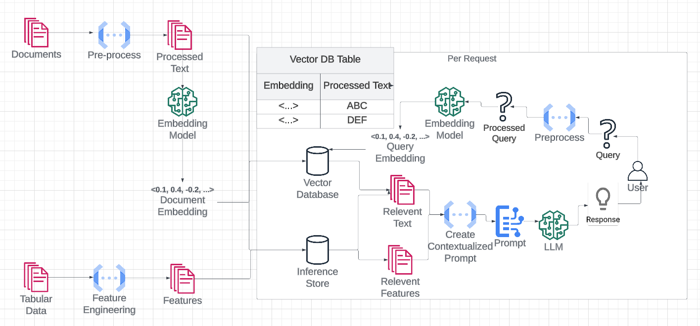

# Earnings Call Transcript Analyzer  
### AI-Powered Insights for Earnings Transcripts  

---

## Project Description
Insightful Consulting Group (ICG) is expanding into investment management and has been tasked with developing an AI prototype to streamline the analysis of earnings call transcripts. During earnings season, research analysts face an overwhelming influx of company earnings releases, making it difficult to extract valuable insights efficiently. This project enhances decision-making and productivity by enabling users to query earnings call transcripts and real-time AI-driven responses.

---

## Dataset
The dataset consists of **earnings call transcripts from 2024**, dynamically retrieved from **[API Ninja's Financial Transcript API](https://api-ninjas.com/)** and preprocessed for **natural language processing (NLP)**. Each transcript includes the following attributes:

- **Industry** – The sector in which the company operates.
- **Ticker Symbol** – The stock ticker uniquely identifies the company.
- **Quarter** – The financial quarter in which the earnings call occurred (Q1, Q2, Q3, or Q4).
- **Year** – The fiscal year corresponding to the earnings call.
- **Transcript Text** – The full text of the earnings call, including statements made by executives and analysts.
- **Date of Transcript** – The specific date when the earnings call occurred.

This structured dataset allows efficient retrieval and analysis, enabling analysts to gain insights quickly and accurately.

### Data Source
Earnings call transcripts are retrieved in real-time using **API Ninja**, a financial data provider offering access to company earnings transcripts. This integration enables the system to dynamically fetch the latest transcripts for informed decision-making.

### Data Preprocessing
To enhance retrieval accuracy and optimize response generation, the AI system applies several preprocessing steps:

1. **API Data Extraction**
   - API requests retrieve transcripts based on industry, company ticker, fiscal year, and financial quarter.
   - The API response is parsed and converted into a structured format for efficient processing.

2. **Text Cleaning & Standardization**
   - Special characters, excessive whitespace, and formatting inconsistencies are removed.
   - Speaker labels (e.g., "CEO", "Analyst") and interruptions are handled for readability.

3. **Metadata Structuring**
   - Industry classifications and company tickers are standardized.
   - Date formats are normalized for consistency and accurate time-based analysis.

These preprocessing steps ensure that earnings call transcripts are clean, structured, and ready for efficient analysis.

---

## Code Structure

The system consists of the following core functions:

1. **`generate_embedding()`**
   - **Purpose**: Creates vector embeddings for a given text chunk.
   - **How it works**: Converts text into numerical representations using a model like OpenAI's `text-embedding-ada-002`. These embeddings facilitate the comparison and retrieval of relevant information.

2. **`chunk_text()`**
   - **Purpose**: Splits long transcripts into smaller, manageable chunks.
   - **How it works**: Breaks the text into 3,000-character chunks with a 500-character overlap, ensuring no loss of context.

3. **`store_embeddings()`**
   - **Purpose**: Manages both chunking and storing of text embeddings.
   - **How it works**:
     - Calls `chunk_text()` to split the text.
     - Uses `generate_embedding()` to create vector embeddings.
     - Stores embeddings in ChromaDB, along with metadata (e.g., company ticker, year, quarter) for efficient retrieval.

4. **`query_rag()`**
   - **Purpose**: Performs retrieval-augmented generation (RAG) by retrieving relevant document chunks.
   - **How it works**:
     - Calls `generate_embedding()` to create an embedding for the user's query.
     - Searches for similar chunks in the vector database.
     - Uses retrieved chunks to formulate a contextually accurate response.

5. **`evaluate_response()`**
   - **Purpose**: Assesses the accuracy and relevance of AI-generated responses.
   - **How it works**: Passes the user’s query, AI response, and retrieved document chunks to a stronger model (e.g., GPT-4 Turbo) for evaluation.

6. **`query_and_display()`**
   - **Purpose**: Processes the user query and displays the generated response.
   - **How it works**: Sends the query through the RAG pipeline (`query_rag()`) and presents the AI-generated response in a user-friendly format.

7. **`update_ticker_dropdown()`**
   - **Purpose**: Ensures that the list of available company tickers is up-to-date.
   - **How it works**: Fetches and updates the list of available companies for querying.

This workflow ensures that transcripts are chunked, embedded, and stored efficiently, enabling rapid and accurate retrieval when users submit queries.

---

## Methodology

### What is Retrieval-Augmented Generation (RAG)?
RAG enhances AI-generated responses by first retrieving relevant text from a database and then using that text to generate precise answers. This approach ensures responses are grounded in actual data rather than relying solely on the AI's built-in knowledge.

### System Workflow

1. **Transcript Retrieval**
   - API Ninja fetches transcripts based on user-selected parameters (company ticker, industry, year, quarter).
   - Retrieved transcripts are processed and stored.

2. **Text Chunking & Vector Embeddings**
   - Transcripts are split into 3,000-character chunks with a 500-character overlap using LangChain’s `RecursiveCharacterTextSplitter`.
   - Each chunk is converted into a vector embedding using OpenAI's `text-embedding-ada-002`.

3. **Storing Vector Embeddings**
   - Embeddings are stored in **ChromaDB** along with metadata (ticker, year, quarter).
   - ChromaDB enables efficient similarity searches.

4. **Query Matching & Context Extraction**
   - The system converts the user’s question into a vector embedding.
   - A similarity search retrieves the most relevant transcript chunks.
   - Retrieved chunks are used to generate AI responses.

5. **LLM Processing**
   - The AI (e.g., GPT-4) generates a response based on retrieved transcript data.
   - If insufficient information is available, the AI states it cannot answer the question based on the document chunks provided.

6. **Response Evaluation**
   - The response is reviewed using an LLM-based evaluation system (`LLM as a Judge`).
   - GPT-4 Turbo assesses faithfulness, relevance, and accuracy.

---

## Visual Representation of the Workflow

## Model Optimization

To improve the model, we optimized on three key areas:

1. **Embedding Model Selection**  
   - Tested OpenAI’s **text-embedding-ada-002** (smaller, faster) vs. **text-embedding-3-large** (larger, more powerful).  
   - **Result:** No significant improvement with the larger model.  The smaller model performed just as well.  

2. **Chunk Size & Overlap Adjustments**  
   - Started with **1,000-character chunks** (200 character overlap).  
   - Switched to **3,000-character chunks** (500 character overlap), which preserved more context and improved response quality.  

3. **Upgrading the Vector Database**  
   - Moved from **FAISS** (efficient but lacked metadata filtering) to **ChromaDB**, which allows filtering by **Ticker, Year, and Quarter**.  
   - **Result:** More precise retrieval of relevant transcript sections, improving accuracy.  

---
## Model Evaluation

The AI system is assessed based on the following key metrics:

### Faithfulness
- Ensures that responses are factually accurate and grounded in the original transcript data.
- Reduces the likelihood of AI-generated hallucinations or misinformation.

### Relevance
- Measures how closely the response aligns with the user's query.
- Prioritizes direct excerpts from transcripts to maintain contextual accuracy.

### AI Confidence Score
- Evaluates the reliability of the AI-generated response based on:
  - **Transcript Matching Percentage** – The degree to which the response aligns with the original earnings call transcript.
  - **Financial Data Consistency** – Ensures accuracy in reported figures such as revenue, profit margins, and other financial metrics.
  - **Linguistic and Contextual Accuracy** – Assesses the coherence, readability, and appropriateness of the response in the given financial context.

---

---

   
# Interactive Product Demo: Gradio UI for Earnings Calls  
### AI-Powered Insights for Earnings Transcripts  

---

## Gradio Interface Overview  
This project features an **interactive Gradio-based user interface**, enabling users to efficiently query and analyze earnings call transcripts. The interface provides an intuitive way for financial analysts and researchers to extract insights from earnings calls in real time.  

---

## Product Demo Walkthrough  

### 1. **Launching the Gradio Interface**  
- The landing page provides a user-friendly input field for querying earnings call transcripts.  
- Users can enter questions in **natural language** to retrieve insights.  

---

### 2. **Entering a Query**  
- Users **select the industry, company ticker, year, and quarter** before entering a question.  
- In this example, the user asks: *"What did the CEO say about revenue growth?"*  
- The system processes the request and retrieves relevant transcript sections.  

---

### 3. **Processing and Generating Results**  
- The AI-powered system searches the **earnings call transcript database** for relevant information.  
- The **Analysis Result** provides a summary of the CEO’s statements on revenue growth.  
- The **Transcript Extracts** section displays the exact text from the earnings call.  

---

### 4. **Quality Score Evaluation**  
- The system assigns a **Quality Score** to evaluate the accuracy and relevance of the generated response.  
- **Faithfulness Score** ensures the answer is accurately grounded in the transcript.  
- **Relevance Score** measures how well the response aligns with the user’s query.  
- The **Overall Quality Score** helps users assess response accuracy.  

---

## Test Cases and Results  
To evaluate the effectiveness of the model, we tested five key question types:  

| **Question Type**   | **Actual Question**                            | **Results**                                                                 | **Human Assessment (Pass/Fail)** | **Tool's Quality Score** |
|---------------------|-----------------------------------------------|-----------------------------------------------------------------------------|----------------------------------|--------------------------|
| **Quantitative**    | What was the company's total revenue?         | System retrieved relevant financial figures from the earnings transcript.   | Pass                             | Faithfulness: 5, Relevance: 5, Overall: 5 |
| **Quantitative**    | How did the company perform last quarter?     | Model returned the latest financial report instead of the previous quarter. | Fail                             | Faithfulness: 5, Relevance: 5, Overall: 5 |
| **Quantitative**    | How did the company perform this quarter?     | Model correctly retrieved the latest financial report.                      | Pass                             | Faithfulness: 5, Relevance: 5, Overall: 5 |
| **Qualitative**     | What did the CEO say about revenue growth?    | Provided a well-structured summary of the CEO’s discussion on revenue.      | Pass                             | Faithfulness: 5, Relevance: 5, Overall: 5 |
| **Inference**       | What was the main reason for revenue growth?  | AI correctly inferred reasoning based on CEO statements and financial data. | Pass                             | Faithfulness: 5, Relevance: 5, Overall: 5 |
| **Off-Topic**       | What is the dinner special for today?         | System correctly stated that no relevant data exists in the document. However, it incorrectly assigned a high relevance score. | Fail                             | Faithfulness: 5, Relevance: 5, Overall: 5 |

---

### **Key Adjustments:**
- The **off-topic question was marked as a fail** because, while the system correctly identified the lack of relevant information, **it incorrectly assigned a relevance score of 5.**
- The **"last quarter" question remains a fail** due to misidentification of the correct timeframe.
- Other questions **remain unchanged**, as they were answered correctly.

---

### **Example: Off-Topic Question Failure**
- In the case of an **off-topic query**, the system correctly determined that **no relevant information** was available in the transcript.  
- However, it failed to **redirect the user** toward a meaningful response or clarification.  

- The **Analysis Result** correctly stated that no information was found, but this **was not useful for the user**.  

- The **Quality Score Evaluation** reflects this, where faithfulness is high (accurate statement), but relevance is low.  

---

## Key Features of the Gradio UI  
- **User-Friendly Interface** – Simple, intuitive design for easy navigation.  
- **Natural Language Processing** – AI understands and responds to financial queries.  
- **Fast and Efficient Retrieval** – Instant transcript search for relevant answers.  
- **Context-Aware Responses** – Maintains the conversation history for follow-up questions.  
- **Summarization and Insights** – Provides key takeaways for quicker analysis.  
- **Response Evaluation** – Quality scores ensure high accuracy and relevance of generated responses.  

---

---

## Conclusion  
The model demonstrates strong capabilities in retrieving relevant answers from earnings call transcripts and evaluating responses through a grading system. This ensures that users receive accurate, contextually appropriate answers. The **Gradio-based user interface** enhances this experience by providing an intuitive and efficient platform for querying financial transcripts. With its ability to process questions effectively and generate well-evaluated responses, the system proves to be a valuable tool for financial analysts and researchers seeking insights from corporate earnings calls.  

---

## Future Enhancements  
The system is continuously evolving with planned improvements, including:  

- **Multilingual Support** – Expanding the model to process and analyze transcripts in multiple languages.  
- **Sentiment Analysis** – Implementing sentiment detection for executive statements to gauge market sentiment.  
- **Real-Time Transcript Updates** – Automating transcript retrieval to ensure access to the latest earnings calls.  
- **Advanced Search Capabilities** – Enhancing query understanding to support more complex financial questions.  
- **Dashboard Integration** – Developing an interactive dashboard for deeper financial insights and data visualization.

---

## License

This project is licensed under the **MIT License**.  
See the [`LICENSE`](LICENSE) file for more details.
